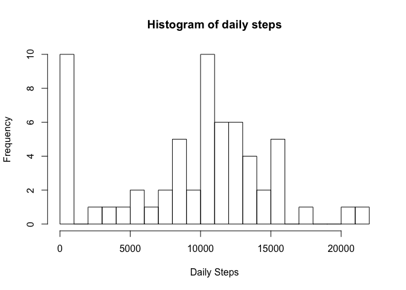
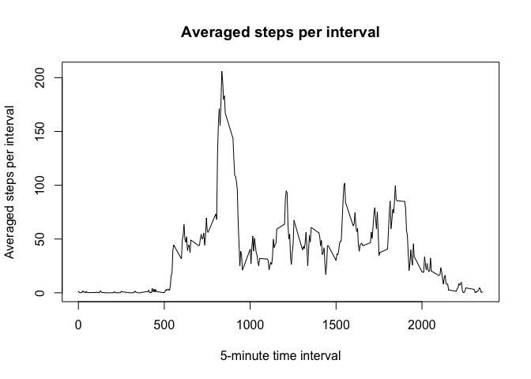
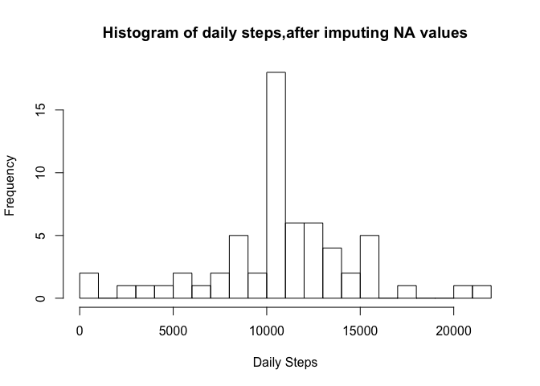
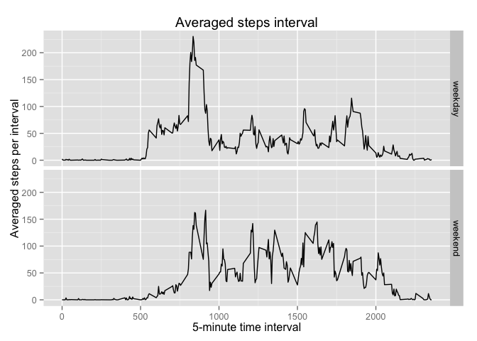

# Reproducible Research: Peer Assessment 1


## Loading and preprocessing the data
Data are in the zipped file "activity.zip"
- unzipped file is CSV
- CSV file has 3 columns
  1. Steps
  2. Date
  3. 5 minute interval corresponding which 5 minute period during the day the 
     steps were recorded
- Missing values are coded as NA   

The code block below unzips activity.zip and reads in the resultant CSV file.
The commands is told that the first and third columns are numbers and the third
is a date column

```r
activity <- read.csv(unz("activity.zip","activity.csv"),
                     colClasses =c("numeric","Date","numeric"))
```

## What is mean total number of steps taken per day?

Now calculate the total number of steps per day, ignoring NA entries

```r
# Find all the unique dates
dates <- unique(activity$date)

# For each date, calculate total number of steps, ignore NA
steps_per_day <- sapply( dates, 
                         function(date) sum(activity[activity$date == date,]$steps,
                                            na.rm=TRUE)
                        )
print(steps_per_day)
```

```
##  [1]     0   126 11352 12116 13294 15420 11015     0 12811  9900 10304
## [12] 17382 12426 15098 10139 15084 13452 10056 11829 10395  8821 13460
## [23]  8918  8355  2492  6778 10119 11458  5018  9819 15414     0 10600
## [34] 10571     0 10439  8334 12883  3219     0     0 12608 10765  7336
## [45]     0    41  5441 14339 15110  8841  4472 12787 20427 21194 14478
## [56] 11834 11162 13646 10183  7047     0
```

A histogram of the steps per day is shown below

```r
hist(steps_per_day,breaks=20,freq=TRUE,
     xlab="Daily Steps",
     main="Histogram of daily steps")
```

 


```r
# Calculate the mean of total number of steps per day
mean_total_steps_per_day <- format(mean(steps_per_day))

# Calculate the median of total number of steps per day
median_total_steps_per_day <- format(median(steps_per_day))
```

The mean of total number of steps per day: 9354.23

The median of total number of steps per day: 10395

## What is the average daily activity pattern?

The plot below show the steps per 5-minute interval, averaged over all days. 

```r
# Get all unique 5-minute intervals
intervals <- unique(activity$interval)

# Calculate mean per 5-minute interval, ignoring NA values
mean_steps_per_interval <- sapply(intervals, 
        function(interval) mean(activity[activity$interval == interval,]$steps,
                                            na.rm=TRUE)
                        )

# Make time series plot of 5-minute interval and averaged steps per interval
plot(x=intervals,y=mean_steps_per_interval,type="l",
     xlab="5-minute time interval",ylab="Averaged steps per interval",
     main="Averaged steps per interval")
```

 

```r
# Find the 5-minute interval with the larged averaged number of steps
max_step_interval <- intervals[ which.max(mean_steps_per_interval) ]
```

The interval with the largest averged number of steps: 835


## Imputing missing values

```r
# Calculate number of rows with missing data (NA)
rows_with_missing_values <- sum(is.na(activity))
```

There are 2304 rows with missing values (NA) in activity data

The code below replaces NA step values with the mean step for that interval

```r
# Use mean of 5-minute interval to replace NA steps value
# replicate mean_steps_per_interval to be same length as activity
mean_steps <- rep(mean_steps_per_interval, 
                    nrow(activity)/length(mean_steps_per_interval))


# Function that will replace step with mean-step if step is NA
replace_na_steps <- function(step, interval, mean_step) {
        if (is.na(step)) {
                step <- mean_step
        }
        
        # Return step
        step
}

new_step <- mapply(replace_na_steps, 
                   activity$steps, activity$interval, mean_steps)

activity$steps <- new_step
```

The histogram below shows the total steps per day, after replacing the NA step values with the mean-steps per inteval.


```r
new_steps_per_day <- sapply( dates, 
                             function(date) sum(activity[activity$date == date,]$steps,
                                            na.rm=TRUE)
                            )
                         
hist(new_steps_per_day,breaks=20,freq=TRUE,
     xlab="Daily Steps",
     main="Histogram of daily steps,after imputing NA values")
```

 


```r
# Calculate the new mean of total new number of steps per day
new_mean_total_steps_per_day <- format(mean(new_steps_per_day))

# Calculate the new median of total new number of steps per day
new_median_total_steps_per_day <- format(median(new_steps_per_day))
```

The mean of total number of steps per day: 10766.19

The median of total number of steps per day: 10766.19

After imputing the steps, the mean and median have increased and both are identical.

## Are there differences in activity patterns between weekdays and weekends?


```r
# Create new column that labels dates either weekday or weekend
day <- weekdays(activity$date, abbreviate = TRUE)
weekday <- ifelse(day == "Sat" | day == "Sun", "weekend","weekday")
activity$weekday <- factor(weekday)

# Make panel plot split by weekday and weekend
# Each plot is a line plot of the averaged number of steps for the 5-minute interval.
library(ggplot2)
g <- ggplot(activity,aes(interval,steps)) 
g + facet_grid(weekday ~ .) + 
        stat_summary(fun.y="mean", geom="line") +
        labs(x ="5-minute time interval") +
        labs(y = "Averaged steps per interval") +
        labs(title = "Averaged steps interval")
```

 

The plot shows the following

- interval < 1000 : there are more steps during the weekday, on average
- interval > 1000 : there are more steps during the wekend, on average

