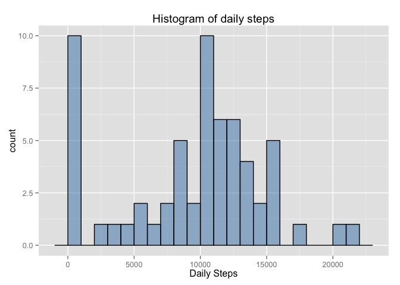
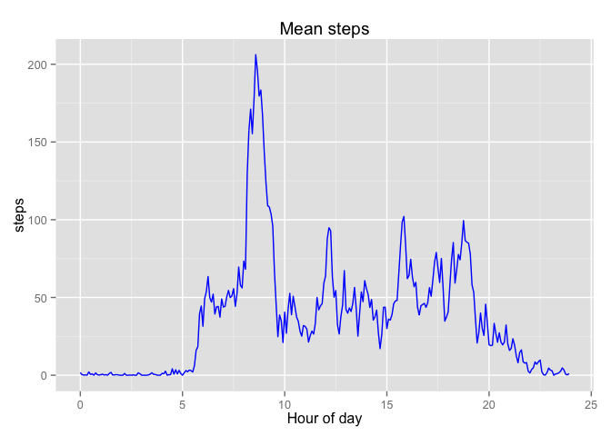
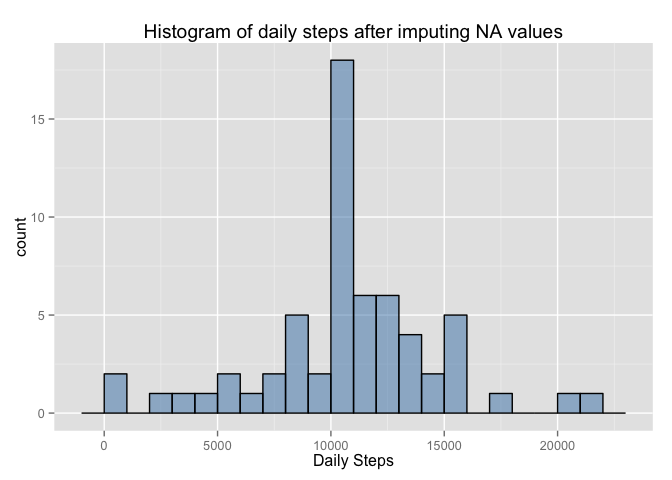
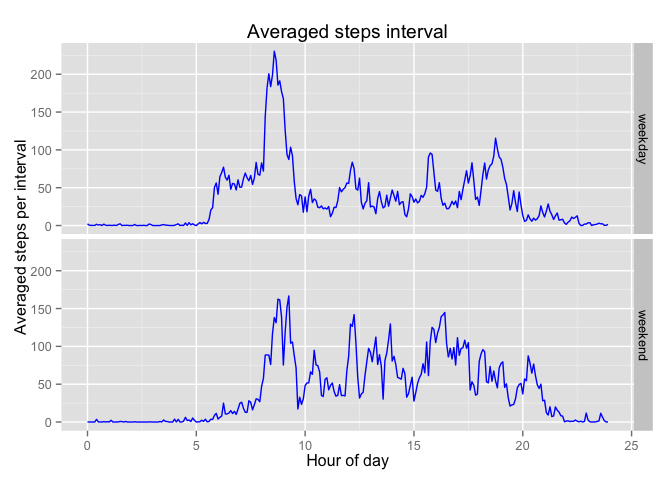

# Reproducible Research: Peer Assessment 1


## Loading and preprocessing the data
Data are in the zipped file "activity.zip"

- unzipped file is CSV
- CSV file has 3 columns
    1. Steps
    2. Date
    3. 5 minute interval corresponding which 5 minute period during the day the steps were recorded
- Missing values are coded as NA   

The code block below unzips activity.zip and reads in the resultant CSV file.
The first and third columns are interpretted as numeric, and the second column is date.


```r
activity <- read.csv(unz("activity.zip","activity.csv"),
                     colClasses =c("numeric","Date","numeric"))

print(head(activity))
```

```
##   steps       date interval
## 1    NA 2012-10-01        0
## 2    NA 2012-10-01        5
## 3    NA 2012-10-01       10
## 4    NA 2012-10-01       15
## 5    NA 2012-10-01       20
## 6    NA 2012-10-01       25
```

The interval corresponds to the time the step was recorded and coded as (hour x 100) + minute. Thus 9:00am is written as 900 and 10:30pm is 2030.

For easier interprataion of the data, the interval is converted to hours, so 9:00am becomes 9.0 hours and 10:30pm becomes 20.5 hours.

```r
# function to convert interval to hours in day
interval_to_hour <- function(x) {
        hour <- floor(x / 100.0)
        minute <- x - (hour*100)
        fract_hour <- hour + (minute/60.0)

        fract_hour
}

frac_hour <- sapply(activity$interval,interval_to_hour)

# append the frac_hour to activity
activity$hour <- frac_hour
print(tail(activity))
```

```
##       steps       date interval     hour
## 17563    NA 2012-11-30     2330 23.50000
## 17564    NA 2012-11-30     2335 23.58333
## 17565    NA 2012-11-30     2340 23.66667
## 17566    NA 2012-11-30     2345 23.75000
## 17567    NA 2012-11-30     2350 23.83333
## 17568    NA 2012-11-30     2355 23.91667
```


## What is mean total number of steps taken per day?

Now calculate the total number of steps per day, ignoring NA entries

```r
# Use aggregate function to sum steps per day and ignore NA entries
library(stats)
steps_per_day <- aggregate(x=activity['steps'],
                   by=list(date=activity$date),
                   FUN=sum,na.rm=TRUE)

print(head(steps_per_day))
```

```
##         date steps
## 1 2012-10-01     0
## 2 2012-10-02   126
## 3 2012-10-03 11352
## 4 2012-10-04 12116
## 5 2012-10-05 13294
## 6 2012-10-06 15420
```

A histogram of the steps per day is shown below

```r
library(ggplot2)
g <- ggplot(steps_per_day,aes(steps))
g + geom_histogram(binwidth=1000,colour="black",fill="steelblue",alpha=0.5) +
  labs(x ="Daily Steps")  +
  labs(title = "Histogram of daily steps") +
  theme_gray()
```

 


```r
# Calculate the mean of total number of steps per day
mean_total_steps_per_day <- format(mean(steps_per_day$steps))
 
# Calculate the median of total number of steps per day
median_total_steps_per_day <- format(median(steps_per_day$steps))
```
 
The mean of total number of steps per day: 9354.23

The median of total number of steps per day: 10395
 
## What is the average daily activity pattern?

The plot below show the steps per 5-minute interval, averaged over all days. 

```r
steps_per_interval <- aggregate(x=activity['steps'],
                        by=list(hour=activity$hour,interval=activity$interval),
                        FUN=mean,na.rm=TRUE)
 
g <- ggplot(steps_per_interval,aes(x=hour,y=steps))
g + geom_line(colour="blue") +
   labs(x ="Hour of day")  +
   labs(title = "Mean steps") +
   theme_gray()
```

 

```r
# Find the 5-minute interval with the larged averaged number of steps
max_step_interval <-  steps_per_interval$interval[ which.max(steps_per_interval$steps) ]

max_step_time <- sub("(\\d\\d)(\\d\\d)","\\1:\\2",
                     sprintf("%04d",max_step_interval),perl=TRUE)
```
 

The time with the largest averged number of steps: 08:35
The likely reason for this time is most people are commuting to work.


## Imputing missing values

```r
# Calculate number of rows with missing data (NA)
rows_with_missing_values <- sum(is.na(activity))
```
 
There are 2304 rows with missing values (NA) in activity data
 
The code below replaces NA step values with the mean step for that interval

```r
# Use mean of 5-minute interval to replace NA steps value
# replicate steps_per_interval to be same length as activity
mean_steps <- rep(steps_per_interval$steps, 
                     nrow(activity)/nrow(steps_per_interval))
 
# Function that will replace step with mean-step if step is NA
replace_na_steps <- function(step, mean_step) {
         if (is.na(step)) {
                 step <- mean_step
         }
         
         # Return step
         step
}
 
new_step <- mapply(replace_na_steps, 
                    activity$steps, mean_steps)
 

activity$steps <- new_step

# re-calculate number of rows with missing data (NA)
rows_with_missing_values <- sum(is.na(activity))
```
 
After imputing NA values, there are 0 rows with missing values (NA) in activity data

The histogram below shows the total steps per day, after replacing the NA step values with the mean-steps per inteval.
 

```r
print(head(activity))
```

```
##       steps       date interval       hour
## 1 1.7169811 2012-10-01        0 0.00000000
## 2 0.3396226 2012-10-01        5 0.08333333
## 3 0.1320755 2012-10-01       10 0.16666667
## 4 0.1509434 2012-10-01       15 0.25000000
## 5 0.0754717 2012-10-01       20 0.33333333
## 6 2.0943396 2012-10-01       25 0.41666667
```

```r
new_steps_per_day <- aggregate(x=activity['steps'],
                                by=list(date=activity$date),
                                FUN=sum,na.rm=TRUE)

g <- ggplot(new_steps_per_day,aes(steps))
g + geom_histogram(binwidth=1000,colour="black",fill="steelblue",alpha=0.5) +
  labs(x ="Daily Steps")  +
  labs(title = "Histogram of daily steps after imputing NA values") +
  theme_gray()
```

 


```r
# Calculate the new mean of total new number of steps per day
new_mean_total_steps_per_day <- format(mean(new_steps_per_day$steps))
 
# Calculate the new median of total new number of steps per day
new_median_total_steps_per_day <- format(median(new_steps_per_day$steps))
```
 
The mean of total number of steps per day: 10766.19
 
The median of total number of steps per day: 10766.19

After imputing the steps, the mean and median have increased and both are identical.
 
# Are there differences in activity patterns between weekdays and weekends?
 

```r
# Create new column that labels dates either weekday or weekend
day <- weekdays(activity$date, abbreviate = TRUE)
weekday <- ifelse(day == "Sat" | day == "Sun", "weekend","weekday")
activity$weekday <- factor(weekday)
 


g <- ggplot(steps_per_interval,aes(x=hour,y=steps))
g + geom_line(colour="blue") +
   labs(x ="Hour of day")  +
   labs(title = "Mean steps") +
   theme_gray()
```

 

```r
# Make panel plot split by weekday and weekend
# Each plot is a line plot of the averaged number of steps for the 5-minute interval.
g <- ggplot(activity,aes(hour,steps)) 
g + facet_grid(weekday ~ .) + 
         stat_summary(fun.y="mean", geom="line", color="blue") +
         labs(x ="Hour of day") +
         labs(y = "Averaged steps per interval") +
         labs(title = "Averaged steps interval") +
        theme_gray()
```

 

The plot shows the following

- During the weekday, there is a lot of activity between 6.0 (6am) < hour < 10.0 (10am), indicated by the peaked structure in the averaged number of steps in the plot above. This period coincides with office commuting hours.  So one could assume this increased activity comes from commuting to work. 
- During the weekend, there is no peak activity between 6.0 (6am) < hour < 10.0 (10am), compared to the weekday plot. But there is more sustained activity throughout the day. This could be due to leisure activities or wekeend chores. 
